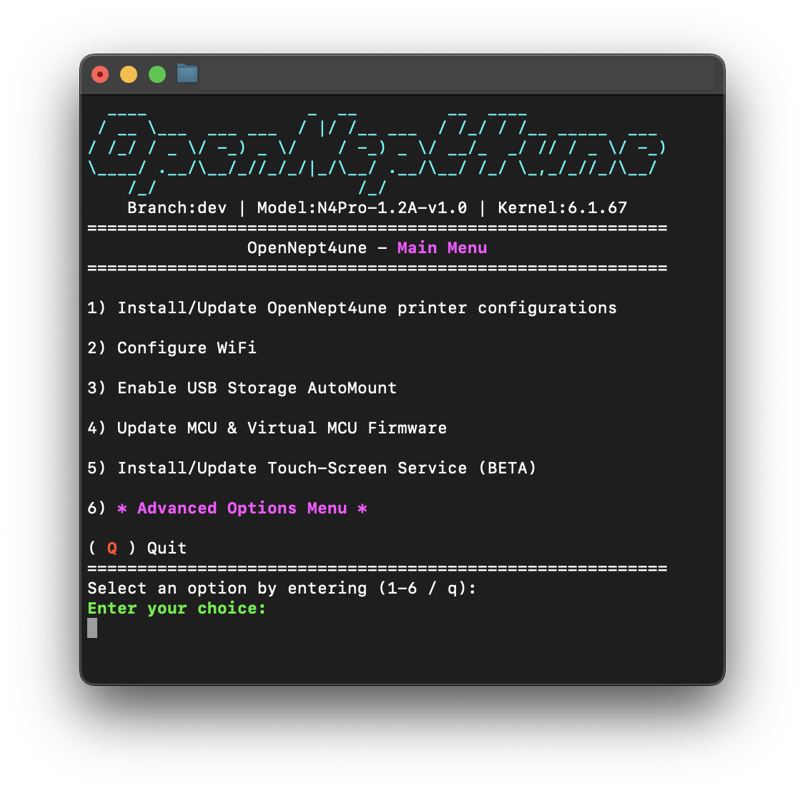
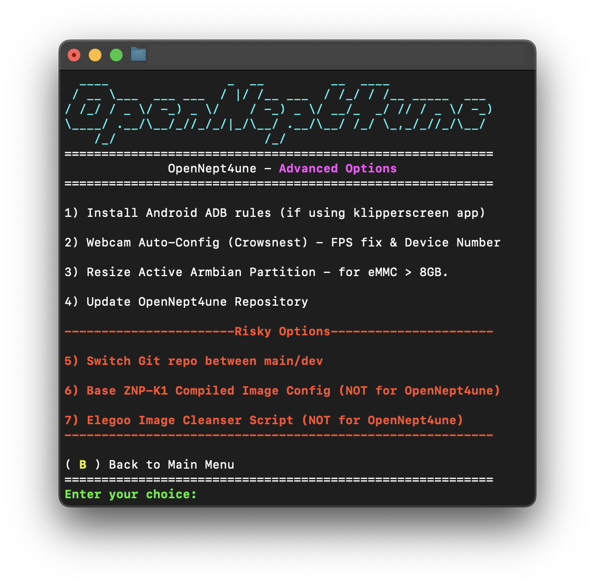

  
  <h1 align="center">OpenNept4une</h1>
  <h1 align="center">De-Elegoo-izing the Neptune 4 Series 3D Printers</h1>

---

| 📥 Download | ⚙️ Installation | 💬 Discord Server |
|---------------------------------------------|---------------------------------------------|--------------------------------------------|
| [Releases](https://github.com/OpenNeptune3D/OpenNept4une/releases/) | [Wiki](https://github.com/OpenNeptune3D/OpenNept4une/wiki) | [Discord](https://discord.com/invite/X6kwchT6WM) |

---

  
### Credits: (Community Members)  
Phillip Thelen, barrenechea, SQUIRRELYMOOSE, DanDonut & Jaerax

**NOTE:** While the latest release file may appear outdated, this project is actively maintained and updated regularly. The main Linux image within the release includes a built-in updater that continuously pulls the latest changes directly from the project’s various GitHub repositories. This ensures that you always have the most recent updates, even if the release file itself hasn’t been changed in a while. Check the commit history for the latest improvements and fixes:

- [OpenNeptune3D/OpenNept4une commits](https://github.com/OpenNeptune3D/OpenNept4une/commits/dev)
- [OpenNeptune3D/display_connector commits](https://github.com/OpenNeptune3D/display_connector/commits/dev)

---
### Image Features
- Support for all Neptune 4 series models 
- Custom Armbian Image (24.2.0 Bookworm with Linux kernel 6.1.67) ([Credit](https://github.com/halfmanbear/Armbian-ZNP-K1-build))
- Klipper v0.12 installed + Easy MCU flash 
- Updatable services, packages & firmware (No need for Elegoo Firmware Updates going forward)
- TouchScreen Support BETA (More responsive)
- All Elegoo Services Removed (No Z-Axis Issues)
- Orca Slicer Profiles Provided
- Adaptive Meshing Configured
- Easy WiFi config
- Simplified and highly modified printer.cfg
- Preconfigured LED, Bed Leveling & PID Calibration Macros
- Screws Tilt Adjust Configured 
- Axis Twist Compensation Configured
- Firmware Retraction configured
- Linux Host CPU & MCU temperature monitoring in Fluidd
- Improved mainboard cooling/fan control
- Crowsnest V4.X (Main) w/ ustreamer (Webcam service)
  
---

  
  

---

### Included Projects: 
  - [Armbian](https://github.com/armbian/build)
  - [(Fork) Armbian-ZNP-K1-build base image](https://github.com/OpenNeptune3D/Armbian-ZNP-K1-build)
  - [display_connector](https://github.com/OpenNeptune3D/display_connector)
  - [KAMP (Klipper-Adaptive-Meshing-Purging)](https://github.com/kyleisah/Klipper-Adaptive-Meshing-Purging)
  - [kiauh (Klipper Installation And Update Helper)](https://github.com/dw-0/kiauh)
  - [Klipper](https://github.com/Klipper3d/klipper)
  - [moonraker](https://github.com/Arksine/moonraker)
  - [fluidd:](https://github.com/fluidd-core/fluidd)
  - [mainsail](https://github.com/mainsail-crew/mainsail)
  - [crowsnest](https://github.com/mainsail-crew/crowsnest)
  - [mobileraker](https://github.com/Clon1998/mobileraker)

