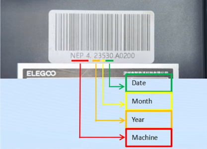
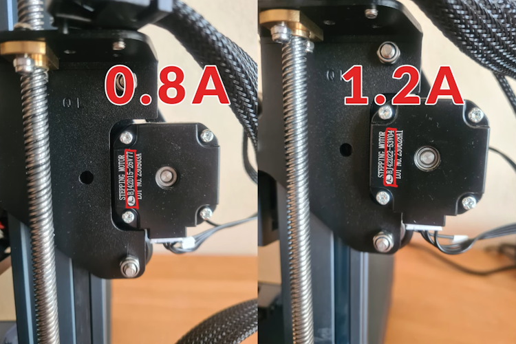
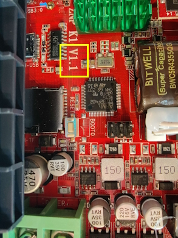

<p align="center">
  
  <h1 align="center">OpenNept4une</h1>
</p>

## De-Elegoo-izing the Neptune 4 Series 3D Printers

**NOTE:** The Touch-Screen Display Service is in Beta (Most functions work and it receives frequent code updates). An alternative until the service is completed is the mobileraker phone app

**LED’s, ADXL & WiFi Working on all Variants**

### Credits:
- Community Members: SQUIRRELYMOOSE, DanDonut, Jaerax, SmartHome42/Printernbeer, Tom's Basement & Phillip Thelen
- Projects: 
  - [Armbian](https://github.com/armbian/build)
  - [(Fork) Armbian-ZNP-K1-build base image](https://github.com/halfmanbear/Armbian-ZNP-K1-build)
  - [KAMP (Klipper-Adaptive-Meshing-Purging)](https://github.com/kyleisah/Klipper-Adaptive-Meshing-Purging)
  - [kiauh (Klipper Installation And Update Helper)](https://github.com/dw-0/kiauh)
  - [Klipper](https://github.com/Klipper3d/klipper)
  - [moonraker](https://github.com/Arksine/moonraker)
  - [fluidd:](https://github.com/fluidd-core/fluidd)
  - [mainsail](https://github.com/mainsail-crew/mainsail)
  - [crowsnest](https://github.com/mainsail-crew/crowsnest)
  - [mobileraker](https://github.com/Clon1998/mobileraker)

### Image Features

- Armbian 24.02.0-trunk Bookworm with Linux 6.1.67-current-rockchip64 ([Credit](https://github.com/halfmanbear/Armbian-ZNP-K1-build))
- Elegoo Services Removed (No Z-Axis Issues)
- KAMP configured and installed
- Bed Leveling Macros
- Axis_Twist_Comp_Tune - Macro ([Klipper Docs](https://www.klipper3d.org/Axis_Twist_Compensation.html))
- PID Calibration Macros
- Easy WiFi config
- Axis Twist Compensation Configured
- Working segmented bed heaters (N4Pro)
- Armbian packages updated (as of Dec 2023)
- No need for Elegoo Firmware Updates (Updated in Fluidd GUI or Kiauh)
- Crowsnest Current (Main) w/ ustreamer
- Orca Slicer Profiles Provided
- Simplified printer.cfg 
- Corrected instructions for Flashing v0.12 Klipper MCU Firmware
- Firmware Retraction configured
- E & Z Steppers configured for 32 microsteps
- X & Y Steppers at 16 microsteps with Interpolation and stealthChop enabled
- SPI ADXL345 & Mellow Fly-ADXL345 USB Accelerometer configuration included
- Support for the Touch-Screen Display

## Install Procedure - Re-flash eMMC with Latest OpenNept4une Release Image

### Overview:

1. Determine the stepper motor current and identify the PCB version (applicable only to N4 & Pro models)
2. Flash your eMMC with the latest OpenNept4une release image
3. Connect your printer to your network (ethernet)
4. Update third-party modules in Kiauh / Fluidd or Mailsail
5. Run the OpenNept4une script and select: 0ption 1) Install the latest OpenNept4une Printer.cfg (Select y for all prompts)
6. After reboot re-run the OpenNept4une script and select: Option 4) Update MCU & (Virtual) MCU RPi Firmware (Select All but skip Pico for now)

### Preparation (N4 & N4 Pro Models Only: If Plus or Max skip to - [Requirements for Flashing the Image](#requirements-for-flashing-the-image)):

During the setup, you'll be asked for two key details: the current for the stepper motors and the PCB version, specific to N4 and N4 Pro models only. Be aware that these two models come with various stepper motors and PCB versions. **Caution:** Incorrectly setting the motor current can cause irreversible damage, so verify your selections carefully.

*Determining Stepper Motor Current:*
Choose one of these methods to determine your motor's current:

1. Serial Number:
Refer to the barcode on your printer. Models before July 2023 (Neptune 4) or June 2023 (Neptune 4 Pro) use 0.8A steppers; later models use 1.2A steppers.



2. Printer.cfg File:
Look in the "TMC UART configuration" section of the printer.cfg file that came with your printer. The run_current for stepper_x and stepper_y will show "0.8" or "1.0 to 1.2".

3. Stepper Inscription:
Check the inscription on the X/Y stepper motors. "BJ42D15-26V77" indicates 0.8A, and "BJ42D22-53V04" indicates 1.2A.



*Determining the PCB Version:*

When you access the eMMC, note the PCB / Main-board's version number, which will be either V1.0 or V1.1.



### Requirements for Flashing the Image:

- Makerbase MKS EMMC-ADAPTER V2 USB 3.0 Reader For MKS EMMC Module: [AliExpress](https://www.aliexpress.com/item/1005005614719377.html)
- Alternatively, a spare eMMC & eMMC > microSD adapter: [AliExpress](https://www.aliexpress.com/item/1005005549477887.html)


### Installation:

- See the [Releases](https://github.com/OpenNeptune3D/OpenNept4une/releases/) section for the latest pre-configured OpenNept4une eMMC Image. Flash with [balenaEtcher](https://etcher.balena.io/).
- Recommended to Back-Up original eMMC beforehand (use dd or similar).
- Run the following startup scripts with Ethernet connected (as user mks)
  
### Printer Terminal Access Options:

#### Terminal / Shell access via SSH (Requires ethernet connection) -
```
ssh mks@printer_ip
Password = makerbase
```
#### PuTTY / Serial terminal access (Without Ethernet) -

Connect N4P USB-C port to PC Then connect via Serial COM8 (yours
will be different) set baudrate to 1500000
```
User: mks
Pass: makerbase
```

### Configure Wi-Fi (skip this if the printer is connected with an ethernet cable)

1. **Access Network Manager:**
Use the following command in the terminal to open the network manager:
```bash
sudo nmtui
```
2. **Connect to Wi-Fi:**
- In the network manager, navigate to `Activate a connection`.
- Select your Wi-Fi network and enter the necessary credentials to connect.

Remember to save your settings before exiting any configuration menus. 

### Run Kiauh for the latest Updates
```bash
~/kiauh/kiauh.sh
```
- In the Kiauh menu, select Option (2), type key (a), and press ENTER.
- Once complete quit out of Kiauh.

### Install latest OpenNept4une Printer.cfg & Update MCU & (Virtual) MCU RPi Firmware

```bash
cd ~/OpenNept4une/ && git fetch --all && git reset --hard origin/main && git clean -fd
```
```bash
~/OpenNept4une/OpenNept4une.sh
``` 

- Perform Option (1): Install the latest OpenNept4une Printer.cfg, When prompted answer (yes) to updating other configurations (KAMP / moonraker etc).
- Once you have rebooted re-run:

```bash
~/OpenNept4une/OpenNept4une.sh
```
- Then Perform Option (4): Update MCU & (Virtual) MCU RPi Firmware (Select All but Skip Pico for now)

# General Configuration Instructions

Follow these steps to configure the basic settings on your Neptune 4 printer's custom Armbian image:

## Configure Correct Timezone

1. **Access Armbian Configuration:**
Open the terminal and enter the following command:
```bash
sudo armbian-config
```
2. **Set Timezone:**
- Navigate to `Personal`.
- Then select `Timezone`.
- Choose and set your correct timezone.

## OrcaSlicer Configs 
- Download the latest Official Release [OrcaSlicer](https://github.com/SoftFever/OrcaSlicer/releases/) 
- Configure Orca defaults for the model of your machine before profile import.
- Check/confirm Bambu Network Engine install
- Download the latest [OrcaSlicer Profiles](https://github.com/OpenNeptune3D/OpenNept4une/tree/main/orca-profiles)
- In OrcaSlicer click [File > Import > Import Configs...]


## Fluidd / Klipper Calibration:

Config / Tuning Macros below (pre-configured in Fluidd
BedTune/Level macros will begin after the heating finishes. Do the Probe Z Offset cold):

`BED_LEVEL_SCREWS_TUNE`\
[Klipper Docs](https://www.klipper3d.org/Manual_Level.html#adjusting-bed-leveling-screws-using-the-bed-probe)
(Rerun macro after each round of corrections)

`CALIBRATE_PROBE_Z_OFFSET`\
(This test should be done cold. Paper Thickness Test. When you determine a value, click Accept and run a `SAVE_CONFIG` command after)

`AUTO_FULL_BED_LEVEL`\
(Not required as using dynamic meshes before print, but useful
to see how level the whole bed is - Click Save Config & Restart
after)

**Note:** 

`PID_TUNE_EXTRUDER`

`PID_TUNE_INNER_BED`

`PID_TUNE_OUTER_BED` (N4Pro only)

[Pressure advance](https://www.klipper3d.org/Pressure_Advance.html) value will need your own data.

[Input shaping](https://www.klipper3d.org/Resonance_Compensation.html) values will also need your own data.
(SPI ADXL345 & Mellow Fly-ADXL345 Pre Configured for tuning)

After editing configs or calibrating, save in the fluidd
interface, then in fluidd select the top right menu \> Host \>
reboot. Avoid direct power cycles; this ensures changes are saved from
RAM to eMMC.

I suggest adjusting the Flow Rate by following the instructions in this link. 
While the other tuning techniques can be beneficial, I advise against doing pressure-advance tuning and control in this context. 
It may be necessary to turn off firmware retraction when conducting retraction tests during the tuning process.
[OrcaSlicer Fine Tuning](https://github.com/SoftFever/OrcaSlicer/wiki/Calibration#Flow-rate)
    
## Slicer Settings 
(If using the provided OrcaSlicer profiles you can skip
    this)


**Displaying Thumbnails on the Original Display**

All Slicers that generate thumbnails that moonraker is capable of understanding should work. The display uses 160x160 pixels to display the thumbnail, so your generated thumbnails should be at least that size.

### Orcaslicer

**START CODE**

NOTE all text including PRINT_START and after must be on one line

```
;Nozzle diameter = [nozzle_diameter]
;Filament type = [filament_type]
;Filament name = [filament_vendor] 
;Filament weight = [filament_density]
PRINT_START BED_TEMP=[hot_plate_temp_initial_layer] EXTRUDER_TEMP=[nozzle_temperature_initial_layer] AREA_START={first_layer_print_min[0]},{first_layer_print_min[1]} AREA_END={first_layer_print_max[0]},{first_layer_print_max[1]}
```

**PRINT END CODE**

```
PRINT_END
```


### Prusaslicer

**START CODE**

NOTE all text including PRINT_START and after must be on one line

    
```
;Nozzle diameter = [nozzle_diameter]
;Filament type = [filament_type]
;Filament name = [filament_vendor]
;Filament weight = [filament_density]
PRINT_START BED_TEMP=[first_layer_bed_temperature] EXTRUDER_TEMP=[first_layer_temperature] AREA_START={first_layer_print_min[0]},{first_layer_print_min[1]} AREA_END={first_layer_print_max[0]},{first_layer_print_max[1]}
```

**PRINT END CODE**

```
PRINT_END
```
