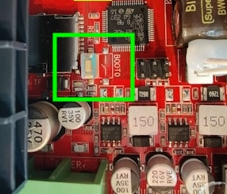

# How to Dump Neptune 4 MCU Firmware

**Warning:** Only flash this firmware on a DE-ELEGOO setup/image, **not** on stock Elegoo software.

## Steps:

1. **Solder a Momentary Button:**
   - Solder a momentary (push to make) button on the BOOT pads on the MKS/Elegoo control board next to the RESET button.
   - Alternatively, further on you will need to bridge these with sharp metal tweezers.
   - 

2. **Power On and Boot Process:**
   - Power on the machine.
   - Press the BOOT button down (or bridge the pads).
   - While this is pressed, also press the RESET button next to it.
   - Release RESET then BOOT.

3. **SSH and Commands:**
   - Leave the printer on, and SSH in (as mks) and type:
     ```
     sudo service klipper stop
     sudo apt update
     sudo apt install stm32flash
     cd ~/
     stm32flash -r firmware-bak.bin /dev/ttyS0
     ```
   - If this errors out, repeat the BOOT/RESET button-press routine above until it works.

4. **Copy Firmware Backup off the Machine (Optional):**
   - From another terminal on the computer, copy this off your printer using:
     ```
     scp mks@IPADDRESS:/home/mks/firmware-bak.bin .
     ```

5. **Reboot:**
   - Type `sudo reboot` (then power cycle after a few minutes).

## How to Flash Updated Klipper MCU Firmware

(Only do this if you have removed Elegoo services and are running standard/updated releases of Klipper.)

1. **Enter Bootloader Mode:**
   - Power on the machine.
   - Press the BOOT button down (or bridge the pads).
   - While this is pressed, also press the RESET button next to it.
   - Release RESET then BOOT.

2. **SSH and Commands:**
   - Leave the printer on, and SSH in (as mks) and type:
     ```
     cd /home/mks/klipper/
     make clean
     make menuconfig
     ```
   - Enter the following configurations using arrow keys and SPACEBAR to select.
   - STMicroelectronics STM32 - STM32F401 - 32KiB Bootloader - and USART PA10/PA9 - settings.
   - Once you have selected the correct options hit the Q key and then Y to close and save.
   - Now run:

     ```
     make
     ```

4. **Flash Klipper Firmware:**
   - Repeat the BOOT and RESET process.
   - Then, type:
     ```
     sudo service klipper stop
     stm32flash -w /home/mks/klipper/out/klipper.bin -v -S 0x08008000 -g 0x08000000 /dev/ttyS0
     ```

5. **Reboot:**
   - Type `sudo reboot` (then power cycle after a few minutes).

6. **If this doesn't work (usually if you flashed MCU firmware before):**
   - Repeat the BOOT and RESET process.
   - Download the provided firmware-bak.bin (in this git repo)
   - Then, flash it with:
     ```
     sudo service klipper stop
     stm32flash -w ./firmware-bak.bin -v /dev/ttyS0
     ```
   - After this reboot going forward you may use the first (compile with make menuconfig) method.
   ## How to Recover OG MCU Firmware

(Pre-dumped N4Pro (might be the same as N4) firmware-bak.bin)

1. **Power On and Boot Process:**
   - Similar to the above steps.
   
2. **SSH and Commands:**
   - Leave the printer on, and SSH in (as mks) and type:
     ```
     sudo service klipper stop
     stm32flash -w firmware-bak.bin -v /dev/ttyS0
     ```
   - If this fails, retry the BOOT & RESET button method above and re-run the stm32flash command.
   - Type `sudo reboot` (then power cycle after a few minutes).

